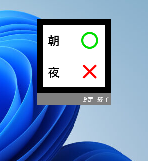

# MedicineReminder

MedicineReminderは薬を飲んだかどうかを記録するソフトウェアです．

# DEMO

# Requirement
Windows OS

# Download
https://github.com/Tsuyopon-1067/MedicineReminder/releases/tag/v1.0
を開いたら，下部の **MedicineReminder.v1.0.zip**  をダウンロード.

# How to use
起動後，画面の○×ボタンを押して薬を飲んだかどうかを記録するだけです．記録は毎日午前0時になるときにリセットされ，全て×印になるので，永久的な記録には使えません．

設定ボタンを押すことで図のようなウィンドウが表示され，表示するタイミングを朝昼夜から任意に選ぶことができます．

起動中にPCの時計を変更すると日付変更によるリセット機能が誤作動し，意図せず記録がリセットされる可能性があります．PCの時計を変更したときは再起動してください．

# Author
つよぽん